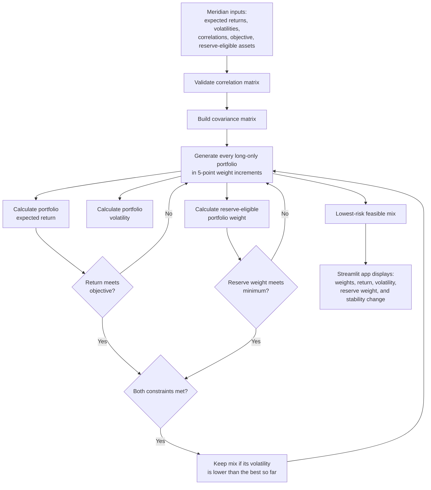

# Lab 15 — Meridian Portfolio Engine Flowchart

```mermaid
flowchart TD
    A[Meridian inputs:<br/>expected returns, volatilities,<br/>correlations, objective, reserve-eligible assets] --> B[Validate correlation matrix]

    B --> C[Build covariance matrix]

    C --> D[Generate every long-only portfolio<br/>in 5-point weight increments]

    D --> E[Calculate portfolio<br/>expected return]

    D --> F[Calculate portfolio<br/>volatility]

    D --> G[Calculate reserve-eligible<br/>portfolio weight]

    E --> H{Return meets<br/>objective?}
    G --> I{Reserve weight meets<br/>minimum?}

    H -->|No| D
    I -->|No| D

    H -->|Yes| J{Both constraints met?}
    I -->|Yes| J

    J -->|Yes| K[Keep mix if its volatility<br/>is lower than the best so far]
    K --> D

    D --> L[Lowest-risk feasible mix]
    L --> M[Streamlit app displays:<br/>weights, return, volatility,<br/>reserve weight, and stability change]
```
